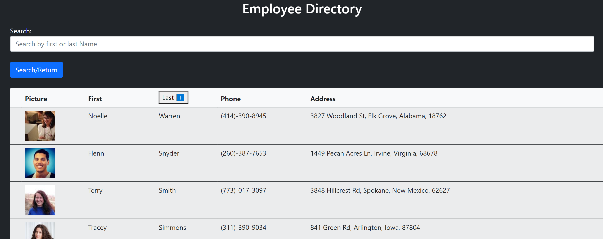

# Employee Directory 
   
  ===========================================
    
  ## Description 
      This is a employee directory built with react.  It uses random users generated from the Random User API in the place of employees.    
  ## Table of Contents 
  - [Installation](#installation)
  - [Usage](#usage)
  - [Contributions](#contributions)
  - [Questions](#questions)
  - [License](#license)
  ## Installation 
  
       npm install in the command line, and then npm start.  The app is also deployed at the link below.
  [https://kellyjohnson364.github.io/employee-directory/](https://kellyjohnson364.github.io/employee-directory/)
  ## Usage 
      This app is intended to show the potential function in a workplace environment where an employer can quickly get a visual representation of his employees.  All employee information is loaded on entering the app and the employer can then search by first or last name, and sort the tables in alphabetical order by name both ascending and descending.

  ## Contributions 
      This was created by:
* KellyJohnson364: [https://github.com/KellyJohnson364](https://github.com/KellyJohnson364)
            
            
            
         feel free to contribute or ask questions
           

   

  ## Questions 
If you have questions or feedback, please contact KellyJohnson364 at [https://github.com/KellyJohnson364](https://github.com/KellyJohnson364) or via email at KJ3641402@gmail.com.

## License
This project is licensed under MIT License.
For more info click [MIT License](./assets/licenses/mitlicense.md).